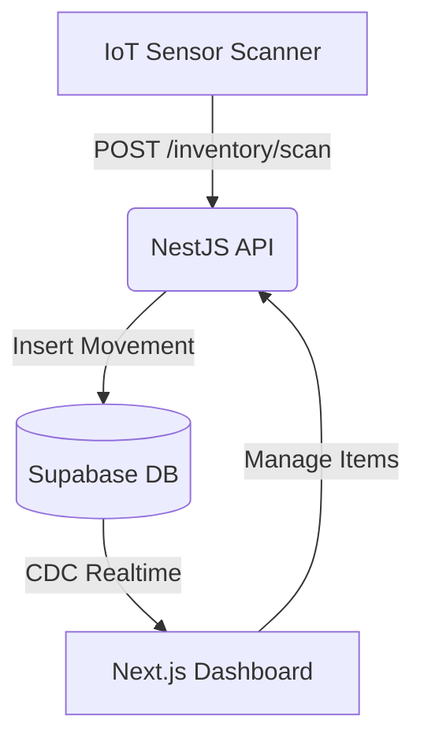

<div align="center">

```text
   ╔═╗╔╦╗╔═╗╔═╗╦╔═
   ╚═╗ ║ ║ ║║  ╠╩╗
   ╚═╝ ╩ ╚═╝╚═╝╩ ╩
  v1.0.0 — IoT Inventory Management
```

**High-performance, real-time stock management with IoT native integration.**

[Features](#-features) • [Quickstart](#-quickstart) • [Architecture](#-architecture) • [IoT API](#-iot-api-reference)

</div>

---

## ⚡ What is Stock?

`Stock` is a full-stack inventory ecosystem designed for speed and reliability. It combines a **NestJS** backend optimized for IoT sensor ingestion with a **Next.js 15** industrial dashboard, all powered by **Supabase Realtime**.

**Zero-latency updates. Industrial design. Built for scale.**

## ✨ Features

- 🕒 **Zero-Latency:** Real-time stock updates (<2s) via Supabase Replication.
- 📡 **IoT Ready:** High-throughput REST endpoint for hardware scanner integration.
- 🔐 **Secure RBAC:** Permission tiers for Admin, Manager, and Operator.
- 🎨 **Industrial UI:** Dark-mode dashboard built with Tailwind v4 and Framer Motion.
- 📊 **Movement Logs:** Every scan is tracked with timestamped accuracy.

---

## 🚀 Quickstart (Developer Route)

### 1. Requirements
Ensure you have `Node.js 20+`, `npm`, and `Supabase` account.

### 2. Installation
```bash
git clone https://github.com/Nitram2704/Stock.git
cd Stock/App
npm install
```

### 3. Environment Config
Set up your `.env` files in both directories:

**`server/.env`**
```env
SUPABASE_URL=your_project_url
SUPABASE_ANON_KEY=your_key
PORT=3001
```

**`web/.env.local`**
```env
NEXT_PUBLIC_SUPABASE_URL=your_project_url
NEXT_PUBLIC_SUPABASE_ANON_KEY=your_key
```

### 4. Seed & Run
1. Execute `supabase/migrations/20260210_initial_schema.sql` in your Supabase SQL Editor.
2. Enable **Realtime** for the `movements` table.
3. Start the engine:
```bash
# Terminal 1: Backend
cd server && npm run start:dev

# Terminal 2: Frontend
cd web && npm run dev
```

---

## 🏗️ Architecture



- **Backend:** NestJS (Node.js) handling business logic and IoT webhooks.
- **Frontend:** Next.js 15 (App Router) with server components and real-time listeners.
- **Database:** PostgreSQL on Supabase with Row Level Security (RLS).

---

## 📡 IoT API Reference

Target the following endpoint for physical scanner integrations:

### `POST /inventory/scan`
Simulate a hardware scan or connect your ESP32/Arduino sensors.

**Payload:**
```json
{
  "product_id": "uuid-of-product",
  "type": "IN" | "OUT",
  "quantity": 1
}
```

**Simulation Tool:**
Use the included PowerShell script to test real-time updates:
```powershell
./simulate_scan.ps1
```

---

## 📁 Project Structure

```text
├── server/          # NestJS Backend (IoT API, Auth, Logic)
├── web/             # Next.js 15 Frontend (Admin Dashboard)
├── supabase/        # Database Migrations & RLS Policies
└── simulate_scan.ps1 # IoT Testing Simulator
```

---

## 🛠️ Tech Stack


---

<div align="center">
  <i>Built for the Next Generation of Logistics.</i>
</div>
